<div align="center">




<a href="https://matheusav.github.io" target="_blank"></a>
<a href="https://www.linkedin.com/in/matheus-avelino-de-jesus-071737188/"></a>
<a href="mailto:matheusjesusavelino@gmail.com"></a>
<a href="https://github.com/MatheusAV?tab=repositories"></a>


</div>

## 🕸️ Sobre mim

<table>
<tr>
<td width="60%" valign="top">

Engenheiro de software com mais de **8 anos** de experiência, com foco em back-end **.NET**
e **C#**. Desde 2022 no setor financeiro, construindo e sustentando integrações críticas para
cooperativas de crédito — **Banco Central (Bacen)**, **Pix**, assinatura digital e **EFD-Reinf**
— em ambientes que combinam monólitos e microsserviços.

APIs REST em **ASP.NET Core**, mensageria com **Apache Kafka** e **RabbitMQ**, e bases em **SQL
Server**, **Oracle/PL-SQL**, **PostgreSQL**, **MySQL** e **MongoDB**, sobre **AWS** e **Azure**.
Produção é meu terreno: causa raiz de falha crítica, gargalo de performance, paralelização
de lote e monitoramento com **Datadog**. No front, **Angular**, **React** e **Vue**.

```csharp
public sealed class Matheus : ISoftwareEngineer
{
    public int      Years      => 8;
    public string   Focus      => ".NET · C# · Microsserviços";
    public string   Domain     => "Financeiro · Bacen · Pix";
    public string[] Queues     => ["Kafka", "RabbitMQ"];
    public bool     OpenToWork => true;
}
```

<details>
<summary><b>🌐 Read in English</b></summary>

<br>

Software engineer with **8+ years** of experience, focused on **.NET** and **C#** back ends.
Since 2022 in the financial sector, building and supporting critical integrations for credit
unions — **Central Bank (Bacen)**, **Pix**, digital signature and **EFD-Reinf** — in environments
that mix monoliths and microservices.

REST APIs on **ASP.NET Core**, messaging with **Apache Kafka** and **RabbitMQ**, and data on **SQL
Server**, **Oracle/PL-SQL**, **PostgreSQL**, **MySQL** and **MongoDB**, over **AWS** and **Azure**.
Production is my ground: root-cause analysis, performance bottlenecks, batch parallelisation
and monitoring with **Datadog**. On the front end, **Angular**, **React** and **Vue**.

</details>

</td>
<td width="40%" valign="top" align="center">


</td>
</tr>
</table>


## ⚡ Arsenal

<div align="center">

**Backend**


**Frontend**


**Dados & Infra**


</div>


## 🎯 Missões em destaque

<table>
<tr>
<td width="50%"><a href="https://github.com/MatheusAV/TechsysLog-Back"></a></td>
<td width="50%"><a href="https://github.com/MatheusAV/techsyslog-web"></a></td>
</tr>
<tr>
<td width="50%"><a href="https://github.com/MatheusAV/mouts-backend-challende"></a></td>
<td width="50%"><a href="https://github.com/MatheusAV/WeatherForecastApp"></a></td>
</tr>
<tr>
<td width="50%"><a href="https://github.com/MatheusAV/TravelRoute"></a></td>
<td width="50%"><a href="https://github.com/MatheusAV/LoginSystem"></a></td>
</tr>
</table>


## 📊 Sentido aranha

<div align="center">

<table>
<tr>
<td width="50%"></td>
<td width="50%"></td>
</tr>
</table>


<br><br>


</div>


## 🕷️ Vamos conversar

<div align="center">

Aberto a oportunidades como **engenheiro de software full stack** — São Paulo, híbrido ou remoto. Disponibilidade imediata e CNPJ ativo.

<a href="https://www.linkedin.com/in/matheus-avelino-de-jesus-071737188/"></a>
<a href="mailto:matheusjesusavelino@gmail.com"></a>
<a href="https://github.com/MatheusAV"></a>
<a href="https://wa.me/5511984024289" target="_blank"></a>
<a href="https://matheusav.github.io" target="_blank"></a>

<br><br>


</div>
