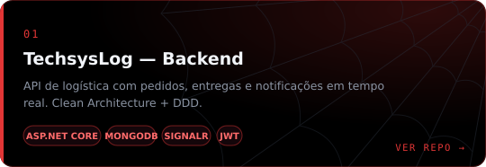
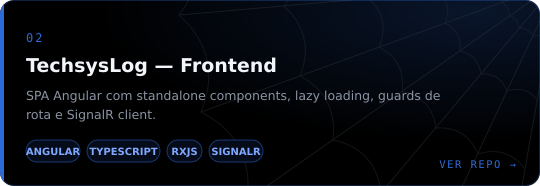
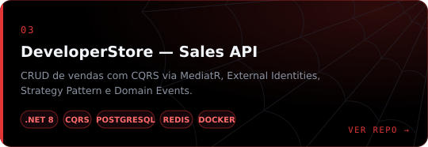
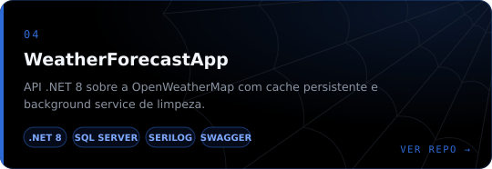
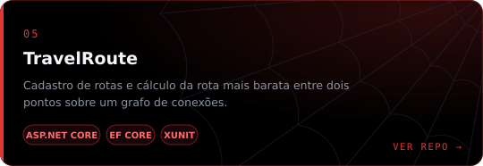
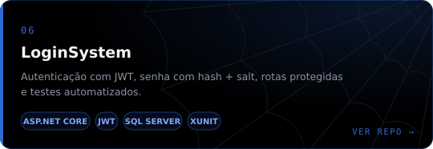
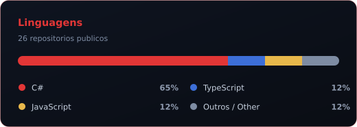
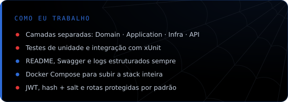

<div align="center">




<a href="https://www.linkedin.com/in/matheus-avelino-de-jesus-071737188/"></a>
<a href="mailto:matheusjesusavelino@gmail.com"></a>
<a href="https://github.com/MatheusAV?tab=repositories"></a>


</div>

## 🕸️ Sobre mim

<table>
<tr>
<td width="60%" valign="top">

Desenvolvedor **backend .NET** em São Paulo. Construo **APIs REST** com ASP.NET Core
pensando em arquitetura antes de código: **Clean Architecture**, **DDD**, **CQRS** e
**SOLID** não são enfeite de README aqui — são a forma como os projetos deste perfil
estão organizados.

No dia a dia trabalho com **C#**, **Entity Framework Core**, **SQL Server**,
**PostgreSQL**, **MongoDB** e **Redis**, com autenticação **JWT**, tempo real via
**SignalR**, logging estruturado com **Serilog**, testes com **xUnit** e containers
com **Docker**. No frontend, entrego a ponta com **Angular** e **TypeScript**.

```csharp
public sealed class Matheus : IBackendDeveloper
{
    public string  Role      => ".NET Backend Developer";
    public string  Location  => "São Paulo, Brasil";
    public string[] Focus    => ["Clean Architecture", "DDD", "CQRS", "SOLID"];
    public bool    OpenToWork => true;
}
```

<details>
<summary><b>🌐 Read in English</b></summary>

<br>

**Backend .NET developer** based in São Paulo, Brazil. I build **REST APIs** with
ASP.NET Core with architecture as a first-class concern: **Clean Architecture**,
**DDD**, **CQRS** and **SOLID** are not README decoration here — they are how the
projects on this profile are actually structured.

Day to day I work with **C#**, **EF Core**, **SQL Server**, **PostgreSQL**,
**MongoDB** and **Redis**, with **JWT** auth, real-time via **SignalR**, structured
logging with **Serilog**, testing with **xUnit** and **Docker**. On the frontend I
ship the last mile with **Angular** and **TypeScript**.

</details>

</td>
<td width="40%" valign="top" align="center">


</td>
</tr>
</table>


## ⚡ Arsenal

<div align="center">

**Backend**


**Frontend**


**Dados & Infra**


</div>


## 🎯 Missões em destaque

<table>
<tr>
<td width="50%"><a href="https://github.com/MatheusAV/TechsysLog-Back"></a></td>
<td width="50%"><a href="https://github.com/MatheusAV/techsyslog-web"></a></td>
</tr>
<tr>
<td width="50%"><a href="https://github.com/MatheusAV/mouts-backend-challende"></a></td>
<td width="50%"><a href="https://github.com/MatheusAV/WeatherForecastApp"></a></td>
</tr>
<tr>
<td width="50%"><a href="https://github.com/MatheusAV/TravelRoute"></a></td>
<td width="50%"><a href="https://github.com/MatheusAV/LoginSystem"></a></td>
</tr>
</table>


## 📊 Sentido aranha

<div align="center">

<table>
<tr>
<td width="50%"></td>
<td width="50%"></td>
</tr>
</table>

<br><br>


</div>


## 🕷️ Vamos conversar

<div align="center">

Aberto a oportunidades como **desenvolvedor backend .NET** — São Paulo ou remoto.

<a href="https://www.linkedin.com/in/matheus-avelino-de-jesus-071737188/"></a>
<a href="mailto:matheusjesusavelino@gmail.com"></a>
<a href="https://github.com/MatheusAV"></a>

<br><br>


</div>
