  

  
  
  
  

## 🕸️ Sobre mim

Desenvolvedor **backend .NET** em São Paulo. Construo **APIs REST** com ASP.NET Core pensando em
arquitetura antes de código: **Clean Architecture**, **DDD**, **CQRS** e **SOLID** não são enfeite
de README aqui — são a forma como os projetos deste perfil estão organizados.

No dia a dia trabalho com **C#**, **Entity Framework Core**, **SQL Server**, **PostgreSQL**,
**MongoDB** e **Redis**, com autenticação **JWT**, comunicação em tempo real via **SignalR**,
logging estruturado com **Serilog**, testes com **xUnit** e containers com **Docker**.
No frontend, entrego a ponta com **Angular** e **TypeScript**.

> *"Com grandes poderes vêm grandes responsabilidades"* — por isso: testes, logs e código que o próximo dev consiga ler.

<b>🌐 Read in English</b>

 

**Backend .NET developer** based in São Paulo, Brazil. I build **REST APIs** with ASP.NET Core with
architecture as a first-class concern: **Clean Architecture**, **DDD**, **CQRS** and **SOLID** are
not README decoration here — they are how the projects on this profile are actually structured.

Day to day I work with **C#**, **Entity Framework Core**, **SQL Server**, **PostgreSQL**, **MongoDB**
and **Redis**, with **JWT** authentication, real-time communication via **SignalR**, structured
logging with **Serilog**, testing with **xUnit** and containerization with **Docker**.
On the frontend I ship the last mile with **Angular** and **TypeScript**.

## 🧰 Stack

<table>
  <tr>
    <td><b>Backend</b></td>
    <td>
      
      
      
      
      
      
    </td>
  </tr>
  <tr>
    <td><b>Frontend</b></td>
    <td>
      
      
      
      
      
      
    </td>
  </tr>
  <tr>
    <td><b>Dados</b></td>
    <td>
      
      
      
      
      
    </td>
  </tr>
  <tr>
    <td><b>Qualidade</b></td>
    <td>
      
      
      
      
      
    </td>
  </tr>
  <tr>
    <td><b>DevOps</b></td>
    <td>
      
      
      
      
    </td>
  </tr>
</table>

## 🚀 Projetos em destaque

<table>
  <tr>
    <td width="50%" valign="top">

### 📦 TechsysLog — Backend
API de logística com pedidos, entregas e **notificações em tempo real**.
Clean Architecture + DDD, MongoDB, SignalR e JWT.

`ASP.NET Core` `MongoDB` `SignalR` `JWT` `xUnit`

[**→ Ver repositório**](https://github.com/MatheusAV/TechsysLog-Back)

  </td>
  <td width="50%" valign="top">

### 🖥️ TechsysLog — Frontend
SPA em Angular com standalone components, lazy loading,
guards de rota e SignalR client conectado ao backend.

`Angular` `TypeScript` `RxJS` `SignalR`

[**→ Ver repositório**](https://github.com/MatheusAV/techsyslog-web)

  </td>
  </tr>
  <tr>
    <td width="50%" valign="top">

### 🛒 DeveloperStore — Sales API
CRUD completo de vendas com **CQRS via MediatR**, External Identities,
Strategy Pattern para descontos e Domain Events.

`.NET 8` `CQRS` `PostgreSQL` `Redis` `Docker`

[**→ Ver repositório**](https://github.com/MatheusAV/mouts-backend-challende)

  </td>
  <td width="50%" valign="top">

### 🌤️ WeatherForecastApp
API .NET 8 que consome o OpenWeatherMap com **cache persistente**,
background service de limpeza e logging com Serilog.

`.NET 8` `SQL Server` `Serilog` `Swagger`

[**→ Ver repositório**](https://github.com/MatheusAV/WeatherForecastApp)

  </td>
  </tr>
  <tr>
    <td width="50%" valign="top">

### 🗺️ TravelRouteCalculator
API de rotas de viagem que calcula o caminho **mais curto e mais barato**
entre origem e destino sobre um grafo de conexões.

`ASP.NET Core` `EF Core` `SQL Server`

[**→ Ver repositório**](https://github.com/MatheusAV/TravelRouteCalculator)

  </td>
  <td width="50%" valign="top">

### 🔐 LoginSystem
Autenticação com JWT, hash + salt de senha, seed de usuário,
rotas protegidas e testes automatizados.

`ASP.NET Core` `JWT` `SQL Server` `xUnit`

[**→ Ver repositório**](https://github.com/MatheusAV/LoginSystem) · [**Frontend**](https://github.com/MatheusAV/login-system-frontend)

  </td>
  </tr>
</table>

## 📊 Linguagens & jeito de trabalhar

<table>
  <tr>
    <td valign="top" width="54%">

  </td>
  <td valign="top" width="46%">

**Como eu trabalho**

- 🧱 Camadas separadas: `Domain` · `Application` · `Infrastructure` · `API`
- 🧪 Testes de unidade e integração, não "funciona na minha máquina"
- 📜 README, Swagger e logs estruturados em todo projeto
- 🐳 Docker Compose para subir a stack inteira com um comando
- 🔒 JWT, hash + salt e rotas protegidas por padrão

  </td>
  </tr>
</table>

## 🕷️ Vamos conversar

Estou aberto a oportunidades como **desenvolvedor backend .NET** — presencial em São Paulo ou remoto.

  
  
  

  🕸️ Feito com café, C# e um pouco de sentido aranha.

